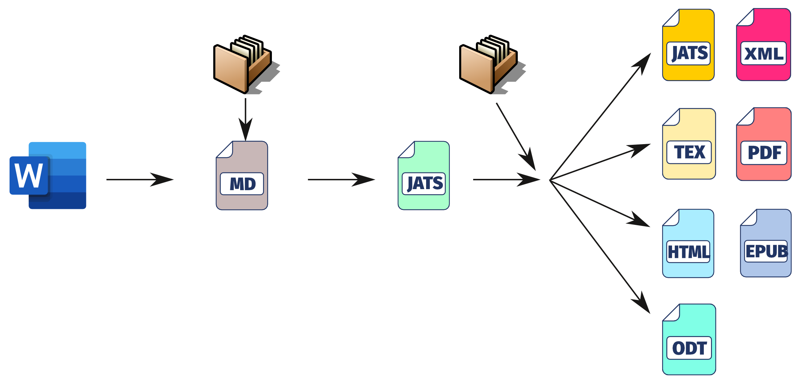

# gbpublisher

Plataforma de producción editorial académica para revistas científicas, series académicas y proyectos editoriales institucionales sobre Linux Mint con escritorio Cinnamon.

> **Plataforma requerida**
> gbpublisher funciona y soportado exclusivamente en **Linux Mint con escritorio Cinnamon y servidor de pantalla X11**. No está soportado en otras distribuciones Linux ni ningún otro sistema operativo. Antes de instalar, verificá que tu sistema cumple este requisito.

---

## Modelo de producción

gbpublisher implementa un flujo **Single Source Publishing**: el contenido se redacta en Markdown, se transforma a JATS XML y se enriquece con metadatos desde una base de datos MySQL. El resultado es un **JATS canónico validado** que actúa como fuente única para todas las salidas editoriales.

Desde ese JATS canónico se generan:

- ODT, EPUB 3, HTML, PDF (vía LuaLaTeX)
- XML para indexadores: DOAJ, Crossref, SciELO, PubMed, Redalyc

Este enfoque garantiza reproducibilidad, trazabilidad y portabilidad total de los contenidos, sin depender de plataformas propietarias ni servicios externos.

---

## Funcionalidades principales

**Gestión de metadatos**
- Autores, afiliaciones, ORCID, ROR
- Referencias bibliográficas (BibTeX/BibLaTeX)
- Palabras clave, datos institucionales, información para indexadores
- Órdenes de taller y control del flujo editorial

**Edición y producción**
- Editor integrado con resaltado de sintaxis para Markdown y XML
- Generación y validación del JATS canónico con `xmllint`
- Transformación a múltiples salidas mediante XSLT 2.0 (Saxon-HE)
- Integración con Pandoc y LuaLaTeX

**Validación y calidad**
- Validación de JATS por flavor (CrossRef, SciELO, PubMed, JATS4R, Redalyc)
- Verificación de DOI contra CrossRef
- Integración con ORCID y DOAJ

---

## Requisitos del sistema

- **Linux Mint con escritorio Cinnamon** (única plataforma soportada)
- **Servidor de pantalla X11** (no compatible con Wayland)
- MySQL/MariaDB
- Gambas 3.21 o superior
- TeXLive full
- Pandoc
- Saxon-HE (JAR principal + carpeta `lib/`)
- Java (para Saxon-HE)

La aplicación verifica las dependencias al iniciar e informa al usuario si falta alguna. El script `integridad.sh` incluido en la distribución permite verificar el entorno antes de instalar.

---

## Licencia

gbpublisher se distribuye bajo la **Business Source License 1.1 (BSL 1.1)**.

**Uso permitido sin costo:** producción editorial de revistas científicas o académicas que no cobren APC (Article Processing Charges) a los autores, bajo cualquier denominación.

**Uso que requiere licencia comercial:** revistas que cobren APC, servicios editoriales para terceros, plataformas SaaS y redistribución del software.

Cada versión publicada convierte automáticamente su licencia a **GPL-3.0-or-later** transcurridos cinco años desde su fecha de lanzamiento.

Véase [LICENSE.md](LICENSE.md) para los términos completos.

---

## Información del proyecto

- Repositorio: [https://github.com/albertomoyano/gbpublisher](https://github.com/albertomoyano/gbpublisher)
- Consultas sobre licenciamiento: estudio2a@outlook.com.ar
- Cómo apoyar el proyecto: [SUPPORT_MODEL.md](SUPPORT_MODEL.md)

**Copyright © 2026 Alberto Moyano**
